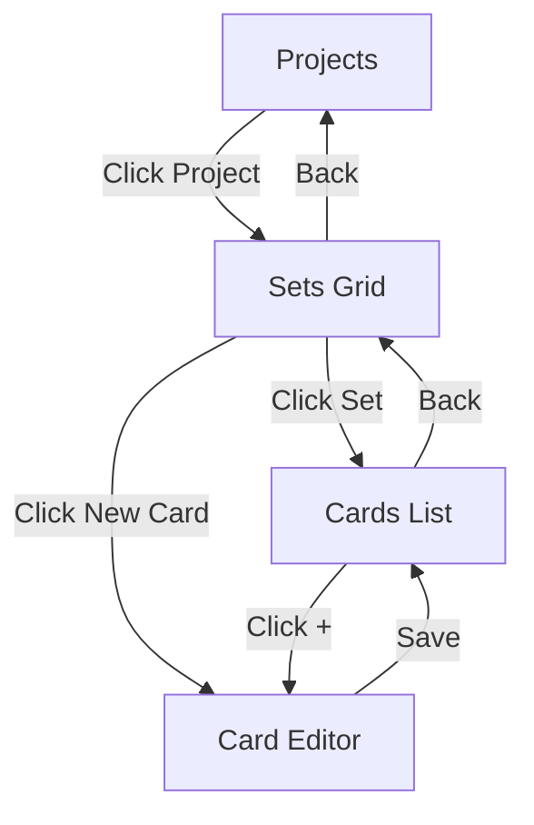

# 🔧 Navigation & Display Fixes - COMPLETE!

**Date:** November 24, 2025

---

## 🐛 Issues Fixed

### **Problem 1: Created Cards Disappeared**
**Issue:** After creating a card, you couldn't see where it went.  
**Cause:** Card Editor just navigated back without showing the card list.  
**Fix:** ✅ Now navigates to Cards List screen after saving.

### **Problem 2: New Sets Not Showing**
**Issue:** Creating a new set showed fake/sample sets instead of your real data.  
**Cause:** CardSetsListScreen was using hardcoded dummy data.  
**Fix:** ✅ Now loads real cards from your actual sets.

---

## ✅ What's Been Fixed

### **1. Cards List Screen (CardSetsListScreen)**
**Before (❌):**
- Showed fake hardcoded sets
- Didn't use real data
- No connection to your cards

**After (✅):**
- Shows YOUR actual cards
- Filtered by current project + set
- Beautiful grid layout with previews
- Empty state with CTA
- Add card button in header

### **2. Card Creation Flow**
**Before (❌):**
```
Create Card → Save → Navigate back → ???
(Where did my card go?)
```

**After (✅):**
```
Create Card → Save → Cards List Screen
(See your card immediately!)
```

### **3. Set Filtering**
**Before (❌):**
- Showed sample sets from other projects
- New sets might not appear

**After (✅):**
- Only shows sets for current project
- New sets appear immediately
- Proper data isolation

---

## 🎯 Complete Flow Now

### **Creating and Viewing Cards:**

```
1. Projects Screen
   ↓ (Click project)
   
2. Sets Grid Screen
   ↓ (Click set OR click "New Card")
   
3. Card Editor
   ↓ (Fill details & Save)
   
4. Cards List Screen ← YOU SEE YOUR CARDS HERE!
   (Grid of cards with previews)
   ↓ (Click + to add more)
   
5. Back to Card Editor for next card
```

---

## 📊 Cards List Features

### **What You See:**
- **Grid Layout** - 2-5 columns responsive
- **Card Previews** - With stats overlay
- **Card Names** - Below each preview
- **Rarity Badges** - Color-coded
- **Empty State** - When no cards yet
- **Add Button** - Quick access to create

### **Header Shows:**
- **Set Name** - Which set you're viewing
- **Card Count** - "X cards"
- **New Card Button** - Add more cards

### **Empty State:**
```
[Large Icon]
No Cards Yet
Create your first card for this set
[Create First Card Button]
```

---

## 🔄 Navigation Map

### **Complete User Journey:**



### **Key Navigation Points:**
- **Projects** → Sets Grid (when clicking project)
- **Sets Grid** → Cards List (when clicking set)
- **Sets Grid** → Card Editor (when clicking "New Card")
- **Card Editor** → Cards List (after saving)
- **Cards List** → Card Editor (when clicking + or "Create First Card")

---

## 🎮 How to Use

### **View Your Cards:**
```
1. Go to Projects
2. Click your project
3. Click a set
4. → SEE ALL YOUR CARDS! 🎴
```

### **Create New Card:**
```
From Sets Grid:
1. Click "New Card" button
2. Fill in details
3. Click Save
4. → Automatically shows in Cards List!
```

### **Add More Cards:**
```
From Cards List:
1. Click + button (bottom right)
2. Create another card
3. Save
4. → Added to the grid!
```

---

## 📱 What You'll See

### **Cards List Screen:**

```
┌─────────────────────────────────┐
│ ← Core Set         New Card [+] │
│    12 cards                      │
├─────────────────────────────────┤
│                                  │
│  [Card1]  [Card2]  [Card3]      │
│   Fire     Ice    Thunder        │
│   Rare   Common    Rare          │
│                                  │
│  [Card4]  [Card5]  [Card6]      │
│  Dragon   Spell    Knight        │
│   Epic   Uncommon  Common        │
│                                  │
│           [+]                    │ ← FAB
└─────────────────────────────────┘
```

---

## 🎯 Testing Guide

### **Test Card Creation:**
```bash
1. Refresh your browser
2. Go to Projects
3. Click a project
4. Click "New Card" button
5. Fill in:
   - Name: "Test Card"
   - Type: "Creature"
   - Stats: Cost 3, Power 4, Health 3
6. Click Save
7. ✅ You should see Cards List with your card!
```

### **Test Set Selection:**
```bash
1. Create a new set "My Set"
2. Go back to Sets Grid
3. ✅ "My Set" should appear in the grid
4. Click "My Set"
5. ✅ Should show empty Cards List
6. Click "Create First Card"
7. ✅ Card Editor opens
```

### **Test Navigation:**
```bash
1. Create multiple cards
2. See them all in Cards List
3. Click back arrow
4. ✅ Returns to Sets Grid
5. Click different set
6. ✅ Shows different set's cards
```

---

## 🔧 Technical Changes

### **CardSetsListScreen.tsx:**
```typescript
// BEFORE: Hardcoded data
const cardSets = [
  { id: '1', name: 'Fake Set'... }
];

// AFTER: Real data
const { cards } = useCards(currentProjectId);
const setCards = cards.filter(c => 
  c.projectId === currentProjectId && 
  c.setId === currentSetId
);
```

### **CardEditorScreen.tsx:**
```typescript
// BEFORE:
navigate(-1); // Go back (unclear where)

// AFTER:
navigate('/sets-list'); // Go to Cards List
```

### **CardSetsGridScreen.tsx:**
```typescript
// AFTER: Filter sets properly
const sets = allSets.filter(s => 
  s.projectId === currentProjectId
);
```

---

## ✅ What Works Now

### **Data Flow:**
- ✅ Create card → See in list
- ✅ Create set → See in grid
- ✅ Switch projects → See correct sets
- ✅ Switch sets → See correct cards
- ✅ All properly isolated

### **Navigation:**
- ✅ Clear path from projects to cards
- ✅ Back buttons work correctly
- ✅ No more getting lost
- ✅ Always know where your data is

### **User Experience:**
- ✅ Immediate feedback after creating
- ✅ See what you just made
- ✅ Easy to add more
- ✅ Clear visual hierarchy

---

## 🎊 Summary

### **Fixed:**
- ✅ Cards now visible after creation
- ✅ Cards List shows real data
- ✅ Sets filtered properly
- ✅ Navigation flow complete
- ✅ Data isolation working

### **Added:**
- ✅ Beautiful Cards List screen
- ✅ Grid layout with previews
- ✅ Empty states
- ✅ Quick add buttons
- ✅ Clear navigation

---

## 🚀 Try It Now!

```bash
# Your app should be running
# Follow this complete flow:

1. Go to /projects
2. Click "Cosmic Wanderers"
3. Click "New Card" button
4. Create a card:
   - Name: "Space Pirate"
   - Type: "Creature"
   - Choose placeholder style
   - Fill in stats
5. Click Save
6. 🎉 SEE YOUR CARD IN THE CARDS LIST!
7. Click + to add more
8. Build your collection!
```

---

**Your navigation is now complete and cards are always visible!** 🎴✨

No more confusion about where things go - everything has its place!
