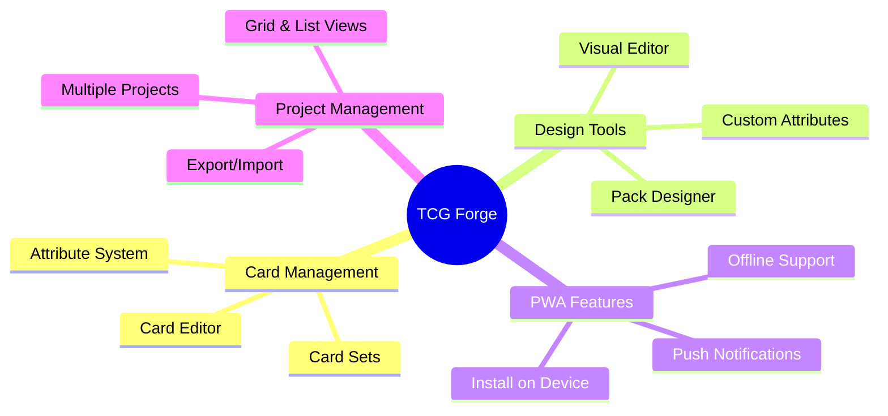
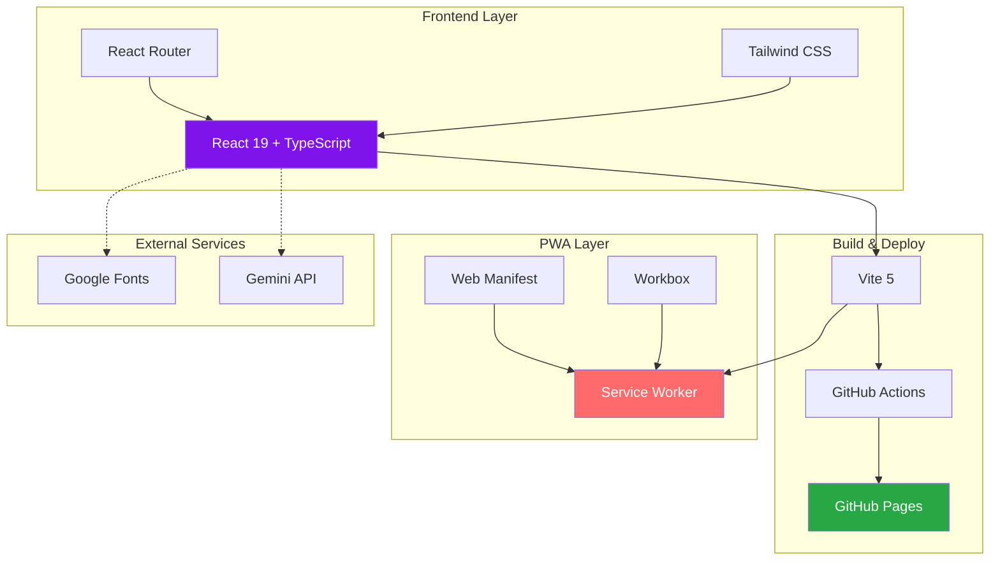
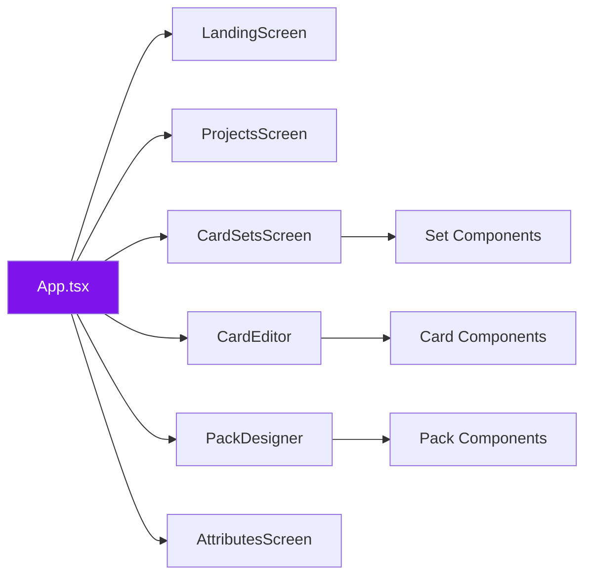
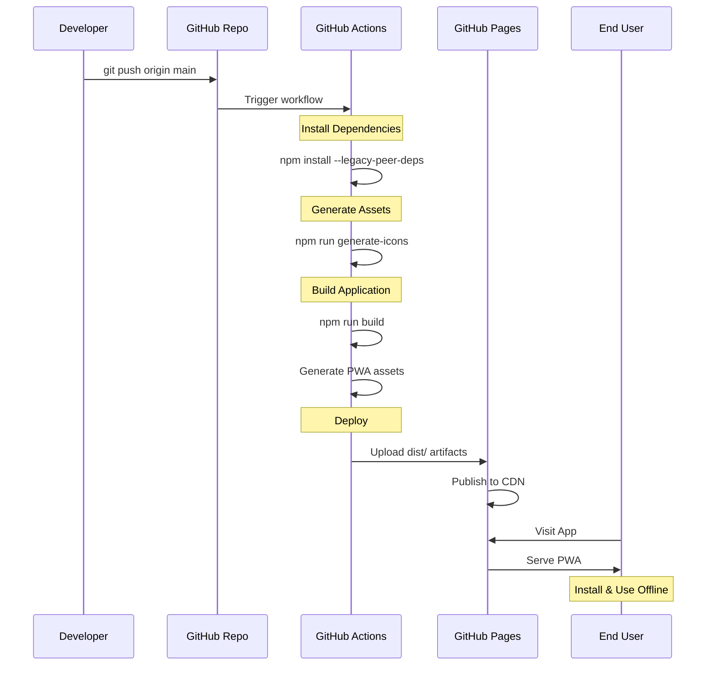

<div align="center">


# 🎴 The TCG Forge

### Create and Manage Your Own Trading Card Game

[](https://cptnope.github.io/The-TCG-Forge/)
[](https://github.com/CptNope/The-TCG-Forge/actions)
[](https://cptnope.github.io/The-TCG-Forge/)

**[🌐 Open App on Android](https://cptnope.github.io/The-TCG-Forge/)** | **[📖 Documentation](./DEPLOYMENT.md)** | **[🐛 Issues](../../issues)**

</div>

---

## 📋 Table of Contents

- [Overview](#-overview)
- [Features](#-features)
- [Architecture](#-architecture)
- [Deployment Flow](#-deployment-flow)
- [Tech Stack](#-tech-stack)
- [Getting Started](#-getting-started)
- [Project Structure](#-project-structure)
- [PWA Features](#-pwa-features)
- [Contributing](#-contributing)

---

## 🎯 Overview

**The TCG Forge** is a modern Progressive Web App (PWA) that empowers users to design, create, and manage their own trading card games. Built with React 19, TypeScript, and Vite, it offers a seamless experience across all devices with offline support and native app-like functionality.

### Key Highlights

✨ **Intuitive Design** - Create cards with a beautiful, modern UI  
🎨 **Full Customization** - Design card attributes, sets, and packs  
📱 **Cross-Platform** - Works on desktop, mobile, and tablets  
🔄 **Offline First** - PWA technology for offline access  
⚡ **Lightning Fast** - Optimized builds with Vite  
🚀 **Auto Deploy** - GitHub Actions CI/CD pipeline

---

## ✨ Features



### Core Features

- 🎴 **Card Editor** - Design custom trading cards with rich attributes
- 📦 **Pack Designer** - Create booster packs and distribution logic
- 🎨 **Attribute System** - Define custom card attributes and types
- 📊 **Set Management** - Organize cards into themed sets
- 🗂️ **Project System** - Manage multiple TCG projects
- 🌓 **Dark Mode** - Eye-friendly dark theme enabled by default
- 📱 **Responsive Design** - Seamless experience across all screen sizes

---

## 🏗️ Architecture



### Component Structure



---

## 🚀 Deployment Flow



### CI/CD Pipeline Steps

1. **Checkout** - Clone repository
2. **Setup Node** - Install Node.js 20
3. **Install** - Download dependencies with legacy peer deps
4. **Generate Icons** - Create PWA icons and favicon
5. **Build** - Compile TypeScript, bundle with Vite, generate service worker
6. **Deploy** - Upload to GitHub Pages

---

## 🛠️ Tech Stack

### Frontend
- **React 19** - Latest React with improved performance
- **TypeScript 5.8** - Type-safe development
- **React Router 7** - Client-side routing with HashRouter
- **Tailwind CSS 3** - Utility-first CSS framework
- **Google Fonts** - Space Grotesk typography

### Build & Dev Tools
- **Vite 5** - Next-generation frontend tooling
- **PostCSS** - CSS transformations
- **Autoprefixer** - Vendor prefix automation

### PWA & Deployment
- **Vite PWA Plugin** - Progressive Web App support
- **Workbox** - Service worker & caching strategies
- **GitHub Actions** - Automated CI/CD
- **GitHub Pages** - Static site hosting

### Optional Integrations
- **Gemini API** - AI-powered features

---

## 🚀 Getting Started

### Prerequisites
- Node.js 18+ 
- npm or yarn

### Installation

```bash
# Clone the repository
git clone https://github.com/CptNope/The-TCG-Forge.git
cd The-TCG-Forge

# Install dependencies
npm install

# Generate PWA icons
npm run generate-icons

# Start development server
npm run dev
```

The app will open at `http://localhost:3000`

### Development Commands

```bash
# Start dev server with hot reload
npm run dev

# Build for production
npm run build

# Preview production build locally
npm run preview

# Regenerate PWA icons
npm run generate-icons
```

---

## 📁 Project Structure

```
The-TCG-Forge/
├── .github/
│   └── workflows/
│       └── deploy.yml          # GitHub Actions workflow
├── public/
│   ├── icons/                  # PWA icons (auto-generated)
│   ├── manifest.json           # PWA manifest
│   └── sw.js                   # Service worker
├── screens/                    # React screen components
│   ├── LandingScreen.tsx
│   ├── ProjectsScreen.tsx
│   ├── CardSetsGridScreen.tsx
│   ├── CardSetsListScreen.tsx
│   ├── CardEditorScreen.tsx
│   ├── PackDesignerScreen.tsx
│   └── AttributesScreen.tsx
├── App.tsx                     # Main app component
├── index.tsx                   # Entry point
├── index.html                  # HTML template
├── index.css                   # Global styles
├── types.ts                    # TypeScript types
├── vite.config.ts              # Vite configuration
├── tailwind.config.js          # Tailwind configuration
├── postcss.config.js           # PostCSS configuration
├── generate-icons.js           # Icon generation script
└── package.json                # Dependencies & scripts
```

---

## 📱 PWA Features

### Installation
Users can install the app directly from their browser:
- **Desktop**: Click install icon in address bar
- **Android**: "Add to Home Screen" prompt
- **iOS**: Share menu → "Add to Home Screen"

### Offline Support
The app works offline thanks to:
- Service worker caching
- Static asset pre-caching
- Runtime caching for external resources

### App-like Experience
- Standalone display mode
- Custom splash screen
- Theme color integration
- Fast loading and smooth transitions

---

## 🎨 Customization

### Theming
Update colors in `tailwind.config.js`:

```javascript
colors: {
  primary: "#7f13ec",
  "primary-dark": "#5e0eb3",
  "background-dark": "#191022",
  "panel-dark": "#1f142b",
}
```

### PWA Icons
Customize icons in `generate-icons.js` then run:
```bash
npm run generate-icons
```

---

## 🤝 Contributing

Contributions are welcome! Please feel free to submit a Pull Request.

1. Fork the repository
2. Create your feature branch (`git checkout -b feature/AmazingFeature`)
3. Commit your changes (`git commit -m 'Add some AmazingFeature'`)
4. Push to the branch (`git push origin feature/AmazingFeature`)
5. Open a Pull Request

---

## 📄 License

This project is open source and available under the MIT License.

---

## 🔗 Links

- **Live App**: https://cptnope.github.io/The-TCG-Forge/
- **Documentation**: [DEPLOYMENT.md](./DEPLOYMENT.md)
- **Vendor Guide**: [VENDOR_GUIDE.md](./VENDOR_GUIDE.md) - Trusted print shops with pros/cons
- **Issues**: [GitHub Issues](../../issues)
- **Deployment Guide**: [DEPLOYMENT.md](./DEPLOYMENT.md)

---

<div align="center">

**Made with ❤️ by CptNope**

[](https://github.com/CptNope)

</div>
