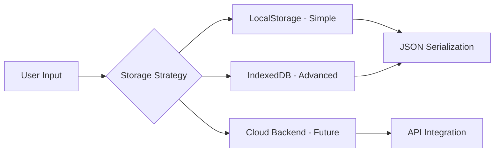
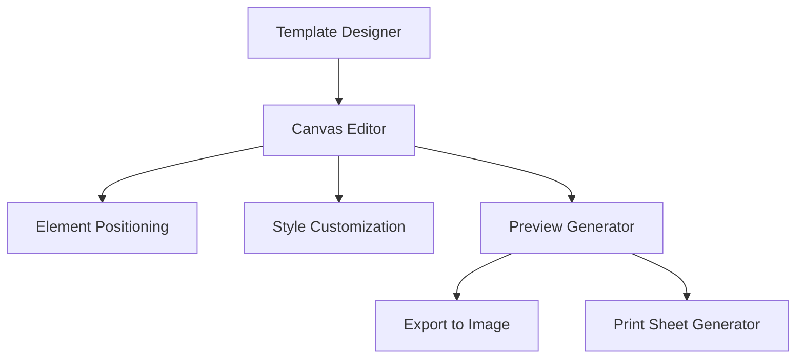
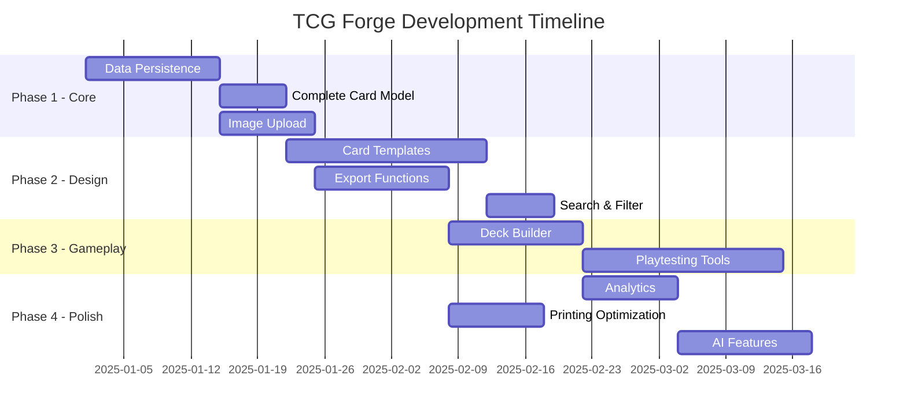

# 🗺️ TCG Forge Roadmap - Path to Full Functionality

This document outlines the missing features and improvements needed to make The TCG Forge a fully functional game design tool.

---

## 🔴 Critical Missing Features (MVP)

### 1. **Data Persistence Layer**
**Status:** ❌ Missing  
**Priority:** CRITICAL

Currently, all data is lost on refresh. Need to implement:



**Implementation Options:**
- **Phase 1:** LocalStorage for projects, cards, sets
- **Phase 2:** IndexedDB for larger datasets + images
- **Phase 3:** Optional cloud sync (Firebase/Supabase)

**Files Needed:**
```
src/
├── storage/
│   ├── localStorage.ts    # Basic storage utilities
│   ├── indexedDB.ts       # Advanced storage
│   └── sync.ts            # Cloud sync (future)
└── hooks/
    ├── useProjects.ts     # Project CRUD hooks
    ├── useCards.ts        # Card CRUD hooks
    └── useSets.ts         # Set CRUD hooks
```

---

### 2. **Complete Card Data Model**
**Status:** ⚠️ Partial (UI only, no data)  
**Priority:** CRITICAL

**Current Missing:**
```typescript
// Need to expand types.ts with:
interface Card {
  id: string;
  name: string;
  type: string;
  cost: number;
  power?: number;
  health?: number;
  abilityText: string;
  flavorText?: string;
  artwork: string;  // Base64 or URL
  rarity: string;
  setId: string;
  attributes: Record<string, any>;
  
  // Additional fields
  artist?: string;
  cardNumber?: string;
  variants?: CardVariant[];
  tags?: string[];
  dateCreated: string;
  dateModified: string;
}

interface CardVariant {
  id: string;
  name: string;
  artwork: string;
  notes?: string;
}
```

---

### 3. **Image Upload & Management**
**Status:** ❌ Missing  
**Priority:** CRITICAL

**Needed:**
- Image upload functionality
- Image cropping/resizing
- Base64 storage or blob URLs
- Fallback placeholder images
- Multiple variants per card

**Libraries to Add:**
```json
{
  "dependencies": {
    "react-dropzone": "^14.2.3",
    "react-image-crop": "^11.0.5"
  }
}
```

**Component:**
```
src/
└── components/
    ├── ImageUploader.tsx
    ├── ImageCropper.tsx
    └── ImageGallery.tsx
```

---

### 4. **Card Template System**
**Status:** ❌ Missing  
**Priority:** HIGH

**Users need to:**
- Define card layouts/templates
- Position elements (name, cost, artwork, etc.)
- Customize colors, fonts, borders
- Preview cards in real-time



**Implementation:**
```typescript
interface CardTemplate {
  id: string;
  name: string;
  width: number;
  height: number;
  elements: TemplateElement[];
  styles: TemplateStyles;
}

interface TemplateElement {
  type: 'text' | 'image' | 'shape' | 'icon';
  position: { x: number; y: number; width: number; height: number };
  binding: string; // e.g., 'card.name', 'card.cost'
  styles: CSSProperties;
}
```

---

## 🟡 Important Features (Post-MVP)

### 5. **Export Functionality**
**Status:** ❌ Missing  
**Priority:** HIGH

**Need to export:**
- ✅ Individual cards as PNG/PDF
- ✅ Full sets as print sheets
- ✅ Project data as JSON
- ✅ Tabletop Simulator format
- ✅ Print-ready PDFs (with bleed/crop marks)

**Libraries:**
```json
{
  "dependencies": {
    "html2canvas": "^1.4.1",
    "jspdf": "^2.5.1",
    "jszip": "^3.10.1"
  }
}
```

---

### 6. **Search & Filter System**
**Status:** ❌ Missing  
**Priority:** MEDIUM

**Features:**
- Search cards by name, type, attributes
- Filter by rarity, set, cost range
- Sort by various fields
- Saved filter presets

---

### 7. **Deck Builder**
**Status:** ❌ Not Started  
**Priority:** HIGH

**Critical for game testing:**
```typescript
interface Deck {
  id: string;
  name: string;
  description: string;
  cards: DeckCard[];
  format?: string; // e.g., "Standard", "Commander"
  tags?: string[];
}

interface DeckCard {
  cardId: string;
  quantity: number;
  isSideboard?: boolean;
}
```

**Features Needed:**
- Add/remove cards
- Set quantities
- Deck validation (min/max rules)
- Statistics (mana curve, type distribution)
- Export to various formats

---

### 8. **Playtesting Tools**
**Status:** ❌ Not Started  
**Priority:** MEDIUM

**Features:**
- Virtual table to test cards
- Draw simulation
- Card interaction testing
- Balance analytics

---

### 9. **Collaboration Features**
**Status:** ❌ Not Started  
**Priority:** LOW (Future)

**For teams:**
- Share projects
- Version control
- Comments & feedback
- Change tracking

---

## 🟢 Enhancement Features

### 10. **Advanced Card Features**
- **Foil/Special editions**
- **Multi-face cards** (front/back, transform)
- **Token generation**
- **Card series/themes**

### 11. **Statistics & Analytics**
- Card count by type/rarity
- Cost distribution
- Power creep analysis
- Set completion tracking

### 12. **Printing Optimization**
- Paper size presets (A4, Letter, etc.)
- Bleed margins
- Cut lines
- Proxy generation

### 13. **AI Integration (Gemini)**
- Generate card text
- Suggest balancing
- Create flavor text
- Generate artwork descriptions

---

## 📊 Development Phases



---

## 🎯 Quick Wins (Implement First)

### Week 1: Data Persistence
1. Create `storage/localStorage.ts`
2. Add `useProjects` hook
3. Wire up Projects screen
4. Add import/export JSON

### Week 2: Card Management
1. Complete Card interface
2. Add `useCards` hook
3. Save/load cards in editor
4. Add card list view

### Week 3: Images
1. Install image libraries
2. Build ImageUploader component
3. Add crop functionality
4. Store as base64 in localStorage

---

## 🛠️ Recommended Tech Stack Additions

```json
{
  "dependencies": {
    // State Management
    "zustand": "^4.5.0",           // Simple state management
    
    // Storage
    "idb": "^8.0.0",               // IndexedDB wrapper
    "localforage": "^1.10.0",      // Better localStorage
    
    // Images
    "react-dropzone": "^14.2.3",   // File upload
    "react-image-crop": "^11.0.5", // Image cropping
    
    // Export
    "html2canvas": "^1.4.1",       // Canvas to image
    "jspdf": "^2.5.1",             // PDF generation
    "jszip": "^3.10.1",            // Zip files
    
    // UI Components
    "react-hot-toast": "^2.4.1",   // Notifications
    "react-modal": "^3.16.1"       // Modals
  }
}
```

---

## 📝 Summary: Core Missing Features

| Feature | Status | Priority | Estimated Effort |
|---------|--------|----------|-----------------|
| Data Persistence | ❌ | CRITICAL | 2 weeks |
| Complete Card Model | ⚠️ | CRITICAL | 1 week |
| Image Management | ❌ | CRITICAL | 1.5 weeks |
| Card Templates | ❌ | HIGH | 3 weeks |
| Export System | ❌ | HIGH | 2 weeks |
| Deck Builder | ❌ | HIGH | 2 weeks |
| Search/Filter | ❌ | MEDIUM | 1 week |
| Playtesting | ❌ | MEDIUM | 3 weeks |

**Total Estimated Time for MVP:** ~8-10 weeks of focused development

---

## 🚀 Next Steps

1. **Implement data persistence** (highest priority)
2. **Complete card CRUD operations** 
3. **Add image upload system**
4. **Build card template engine**
5. **Implement export functionality**

Once these 5 core features are complete, you'll have a **fully functional TCG design tool**!
